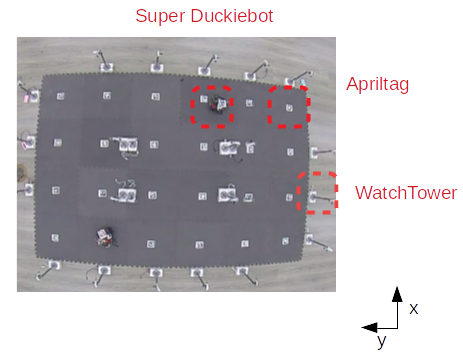
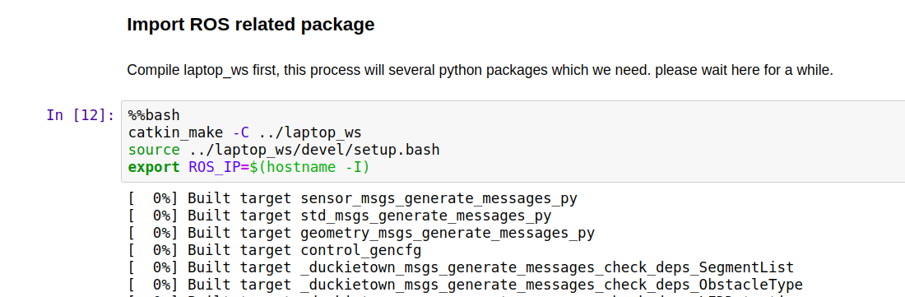
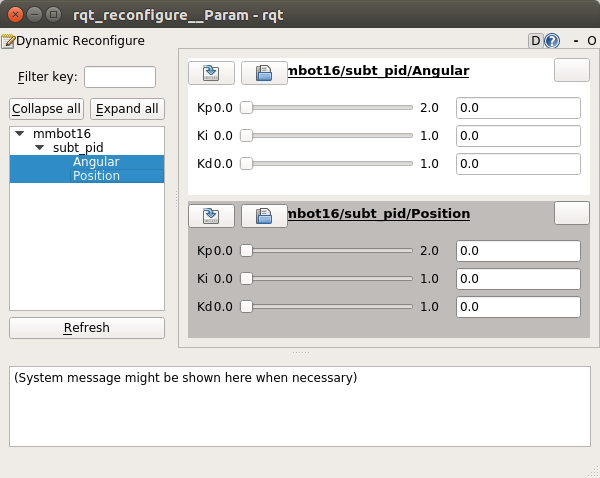

# 03-robot-navigation

</img>
    
## How to run

**Please choose a laptop as main path planner for the robot in your group.** 

Robot:
```bash
    cd ai-course-2019/03-robot-navigation

    byobu   # Launch a local terminal process to avoid program death when broken network.

    # Check ROS MASTER has been launched on the workstation which ip is 192.168.50.150
    source docker_run_robot.sh
```

Laptop:
```bash
    # Terminal 1
    cd ai-course-2019/03-robot-navigation
    source docker_run_laptop.sh
    ----- In the container -----
    jupyter notebook
    # For topic 1, you can run the jupyter notebook completely.
    # For topic 2(real robot exp), you can run until real robot path planning shown below. 

    # Terminal 2
    source docker_run_laptop.sh same
    ----- In the container -----
    source laptop/devel/setup.sh
    roslaunch demo ai_course_demo.launch

    # Terminal 3
    source docker_run_laptop.sh same
    ----- In the container -----
    source laptop/devel/setup.sh
    rosrun rqt_gui rqt_gui -s reconfig
```

Terminal 1 (for topic 2): Please finish this code block and switch to terminal 2. <br />
</img><br />

Terminal 3: PID configuration window <br />
</img><br />

**Back to jupyter window, then continue conducting path planning for the robot.**
 

## Acknowledgements
TAs: Eric Lu, Benson Lee, Alex Chang, Lily Hsu, Jack Chang, Sam Liu
